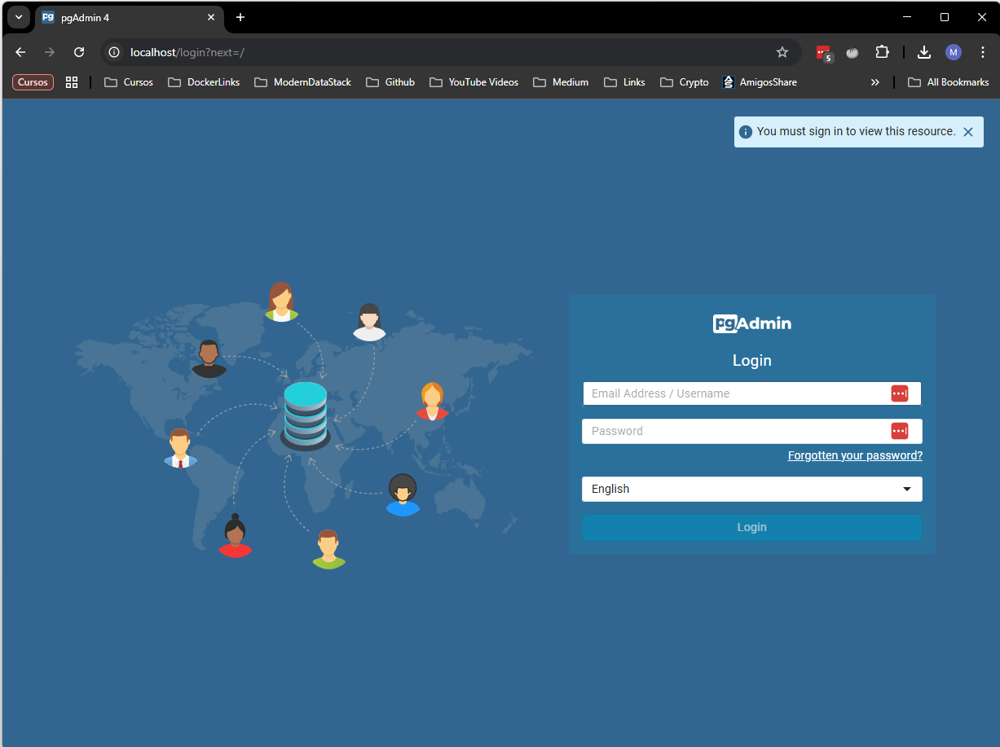

# Install Airbyte Local (Docker)
---

Link:
[Airbyte Doc](https://docs.airbyte.com/platform/using-airbyte/getting-started/oss-quickstart)

## Docker Commands

Check if container is running
    docker ps

Start Airbyte Container

    docker start airbyte-abctl-control-plane

Stop Airbyte Container

    docker stop airbyte-abctl-control-plane

---    

# Containers Postgres + PGAdmin Container

Start Postgres + PGAdmin Containers

    docker-compose -f docker-compose.yml up -d

Stop Postgres + PGAdmin Containers

    docker-compose down

### Access PGAdmin

Link

    localhost:80

